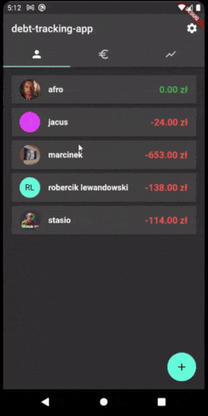
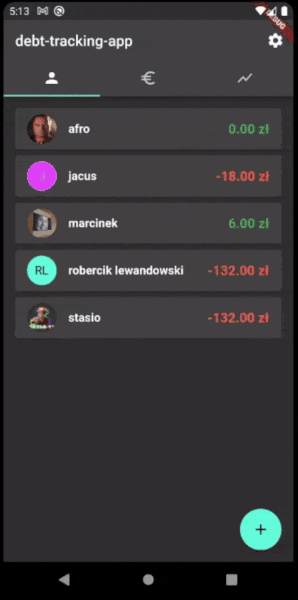

# debt_tracking_app
A flutter app for tracking your friends debts for Android and iOS.  
Uses [sqflite](https://pub.dev/packages/sqflite) and [shared_preferences](https://pub.dev/packages/shared_preferences) for storage and [provider](https://pub.dev/packages/provider) for state management.  

## ⚠ Disclaimer
Not tested on iOS cuz i don't have an iphone
## Features
- Record debts to easily know how much your friends owe you
- Choose multiple people for one debt, useful for scenarios like splitting the cost of a pizza
- Record payments
- View a person's financial history with you
- Customize app style and currency
## Installation
1. Clone this repository  
`git clone https://github.com/szczursonn/debt-tracking-app`  
`cd debt-tracking-app`  
2. Install dependencies  
`flutter pub get`
3. Run  
`flutter run`  
## To be added
- Variable decimal point in currency + more currencies
- App Language selection
- Additional way to backup database (in addition to Android Auto Backup and iOS equivalent)
- Store user avatars as files instead of blobs in sqlite